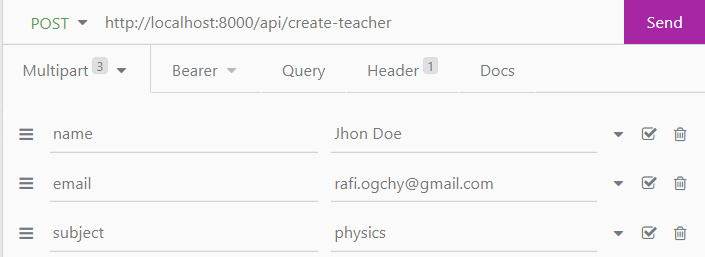

# Dorik - Backend Test Project (Virtual Classroom)

---
## 🔦 Application Overview

A Laravel Rest API for a virtual classroom. This application can be accessed by kind of API client (Postman, Insomnia ect.). 

For this demo purpose, **Insomnia** API client is used here.

## Types of User

- Admin _(Super user)_
- Teacher _(Moderated user)_
- Student _(Restricted user)_

## Authentication & Application Security 

For Auth & application security Laravel Sanctum is used. Sanctum is a built in Laravel  featherweight authentication system for SPAs (single page applications), mobile applications, and simple, token based APIs.anctum allows each user of your application to generate multiple API tokens for their account. These tokens may be granted abilities / scopes which specify which actions the tokens are allowed to perform. 

---

# App Demo

A built in admin is created for the application & the admin has the all CRUD access. 

we will use the following user type for the application

- 1 for Admin
- 2 for Teachers
- 3 for Students

### Login

**Endpoint :**

    /api/auth/login

**⚒️ Credentials for Admin:**

    email - admin@email.com
    password - password

**Expected Successful Response**

    {
    "status": "Success",
        "message": null,
        "data": {
        "token": "2|VNK4f81SJqDAGDH6YrER6nlRmjKeVlYNT4hIvE3C",
            "user": {
            "id": 1,
            "name": "Shakib Al Hasan",
            "email": "admin@email.com",
            "email_verified_at": null,
            "role": 1,
            "created_at": null,
            "updated_at": null
            }
        }
    }
    
Note the token `VNK4f81SJqDAGDH6YrER6nlRmjKeVlYNT4hIvE3C`, this will be used as Bearer token for future requests with a `Bearer` prefix.

### Create a Teacher (Admin only)

**Endpoint :**

    /api/create-teacher

**⚒️ Request Parameters:**

    name 
    email
    subject

**Expected Successful Response**

    {
	"status": "Success",
	"message": null,
	"data": { "message": "Teacher Created" }

Created Teacher will receive confirmation & auto-generated password through email.

### Create Classroom

Only admin & teachers can create a classroom. A Teacher can create a class only of his registered subject.

**Endpoint :**

    /api/create-classroom

**⚒️ Request Parameters:**

    subject

**Expected Successful Response**

    {
	"status": "Success",
	"message": null,
	"data": {
    "message": "Classroom Created",
    "classroom": {
        "subject": "physics",
        "user_id": 1,
        "invitation_code": "E0m9fPNDruh7",
        "updated_at": "2021-12-12T09:47:22.000000Z",
        "created_at": "2021-12-12T09:47:22.000000Z",
        "id": 3
        }
	  }
    }

### End Classroom

**Endpoint :**

    /api/end-classroom/{class_id}

**Note: include your bearer token**

**Expected Successful Response**

    {
	"status": "Success",
	"message": null,
	"data": {
		"message": "Classroom Ended"
	  }
    }

### Create Post (Assignment/Exam) 

Restricted for admin & teachers
**Endpoint :**

    /api/create-post

**⚒️ Request Parameters:**

    type
    deadline
    attachment (image/pdf)
    class_id

**Note: include your bearer token**

**Expected Successful Response**

    {
	"status": "Success",
	"message": null,
	"data": {
    "message": "Post Created",
    "classroom": {
        "type": "assignment",
        "deadline": "2021-12-13T15:00:00.000000Z",
        "user_id": 1,
        "attachment": "posts\/f6C3maKuwAkZaVwzpfiOFsSlKA1KrEEFxcweN4c3.pdf",
        "class_id": "2",
        "updated_at": "2021-12-12T08:09:54.000000Z",
        "created_at": "2021-12-12T08:09:54.000000Z",
        "id": 6
        }
      }
    }

## Register for a class (For students)

### Step 1

To subscribe for a particular class, register with an invitation code at the very first step.

_Note: No Bearer token required_
**Endpoint :**

    /api/subscribe-to-class-step-1

**Expected successful return**

    {
	"status": "Success",
	"message": null,
	"data": {
     "success": "Go for the second step"
	  }
    }

### Step 2

**Endpoint :**

    /api/subscribe-to-class-step-2

**⚒️ Request Parameters:**

    email
    password
    school_id
    name

**Expected Successful Response**

    {
	"status": "Success",
	"message": null,
	"data": {
		"success": "Student Registered Successfully !"
	 }
    }

## See upcoming deadlines (For students)

To see upcomming deadliens of you registered class, you have to login a student first.

**Endpoint :**

    /api/view-upcoming-deadlines

**Expected Successful Response**

    [
	{
		"id": 1,
		"school_id": 134,
		"class_id": 1,
		"classroom": null
	},
	{
		"id": 3,
		"school_id": 134,
		"class_id": 2,
		"classroom": {
            "id": 2,
            "subject": "bangla",
            "posts": [
                {
                    "id": 5,
                    "type": "assignment",
                    "attachment": "posts\/ilO4TbGuf7C692UbUwWJ7se6BpFfjMbCA2cZbZ3Y.pdf",
                    "deadline": "2021-12-10T15:00:00.000000Z",
                    "class_id": 2
                },
                {
                    "id": 6,
                    "type": "assignment",
                    "attachment": "posts\/f6C3maKuwAkZaVwzpfiOFsSlKA1KrEEFxcweN4c3.pdf",
                    "deadline": "2021-12-01T22:00:00.000000Z",
                    "class_id": 2
                }
            ]
		}
	}
    ]

The response will send all posts by the corresponding teacher, and only to those classes the student is registered to.

## Submit assignment/exam answer (For students)

Login as a student first.

**Endpoint :**

    /api/submit-assignment-answers

**⚒️ Request Parameters:**

    student_id
    post_id
    attachment (image/pdf)

**Note: include your bearer token**

**Expected Successful Response**

    {
    "status": "Error",
    "message": "The deadline is over",
    "data": null
    }
or

    {
    "status": "Error",
    "message": "The class has been ended",
    "data": null
    }
or

    {
    "status": "Success",
    "message": "attachment submitted",
    }

## See results for end classes (For students)

Login with your student credentials

**api endpoint**

    /api/see-results

### Expected successful reponse

## Sing out

**api endpoint**

    /api/aut/logout
### Expected successful reponse

    {
	  "message": "User logged out"
    }

